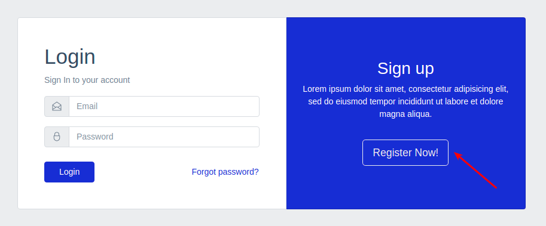

# Регистрация

Ссылка на регистрацию отображается сразу при попытке открытия главной страницы неавторизованным пользователем:



По клику открывается отдельная страница с формой:


* **Name** - произвольное имя пользователя
* **Email** - email пользователя, должен быть уникальным
* **Username** - никнейм пользователя, может содержать буквы и цифры, должен быть уникальным
* **Password** - пароль пользователя, длина не менее 8 символов
* **Confirm Password** - подтверждение пароля пользователя, должно быть равно значению в предыдущем поле
* **Website** - ссылка на сайт пользователя

Все поля, кроме **website**, обязательны для заполнения.

После завершения процесса регистрации пользователь будет аутентифицирован и может начать пользоваться приложением.

Если загрузить первоначальные данные с помощью команды:

```
make backend-seed
```

То можно получить готовых для авторизации пользователей:
```
admin@checklister.test (c правами администратора)
password

user@checklister.test
password
```

---

Следующее: [Аутентификация](../05-auth/README.md)
