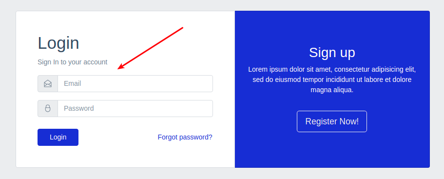
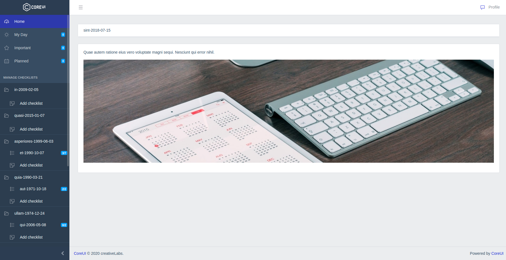
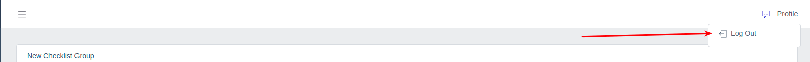

# Аутентификация

Страница аутентификации (*login*) отображается сразу при попытке открытия главной страницы неавторизованным пользователем:

После успешной аутентификации происходит переадресация на главную страницу приложения:

Завершить пользовательский сеанс можно в меню профиля пользователя:

---

Следующее: [Сброс пароля](../06-forgot/README.md)
