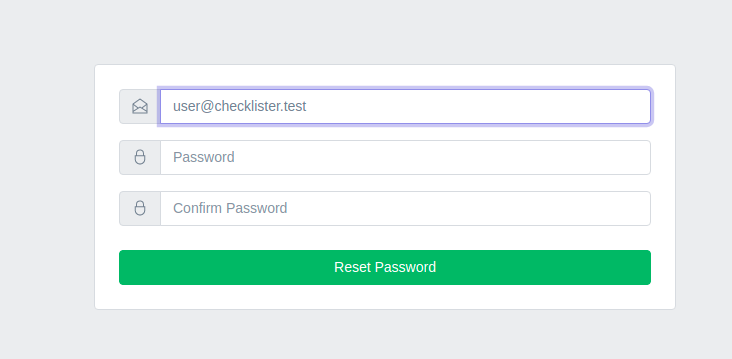

# Сброс пароля

Если пользователь забыл пароль, он может запросить сброс пароля и установить новый пароль.

Ссылка на сброс пароля находится на странице аутентификации:

Далее откроется страница для ввода email, для которого необходимо сбросить пароль:

После заполнения формы на почту придёт письмо:

Перейдя по ссылке можно установить новый пароль:

После сброса пароля можно повторно аутентифицироваться в приложении.

---

Следующее: [WIP](../wip/README.md)
