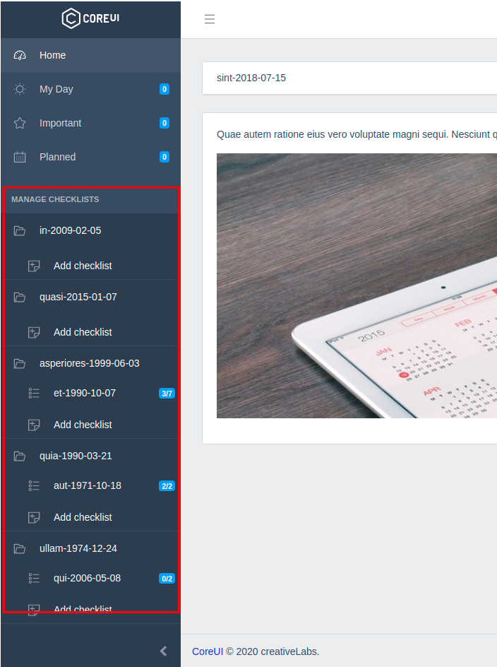
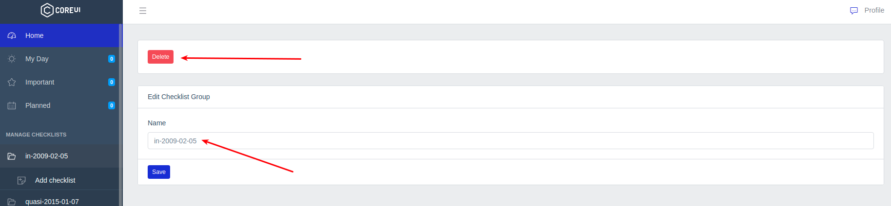
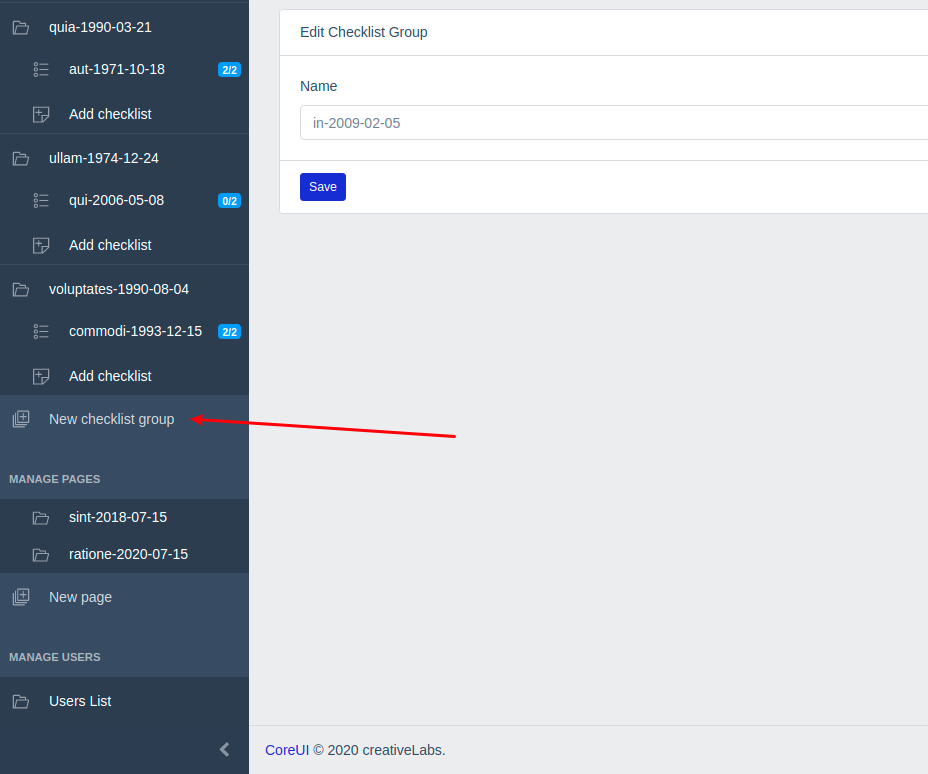
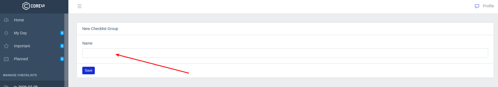

# Группы чеклистов

В боковом меню приложения выводятся группы чеклистов:

Пользователям с правами [администратора](../07-checklists/README.md) по клику на название группы открывается страница редактирования, здесь можно изменить наименование этой группы или удалить саму группу:

Также в боковом меню пользователям с правами [администратора](../07-checklists/README.md) доступна ссылка на создание новой группы чеклистов:

Здесь необходимо указать название для новой группы:

---

Следующее: [Чеклисты](../09-checklists/README.md)
