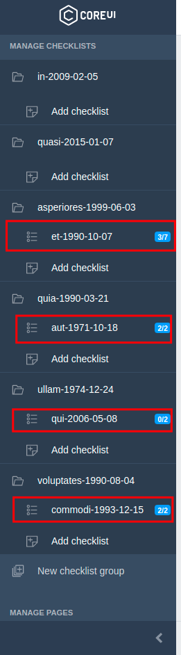
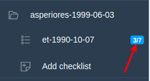
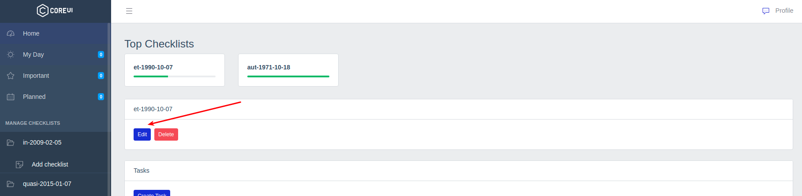
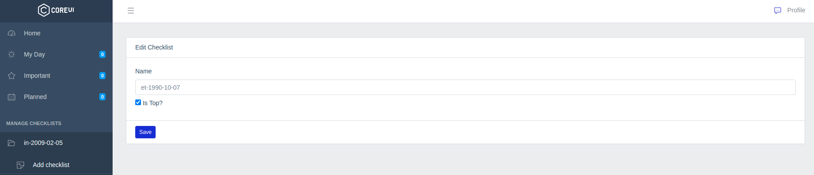
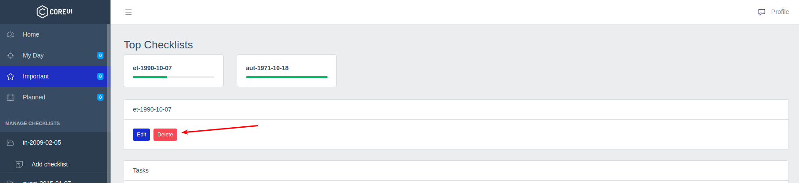
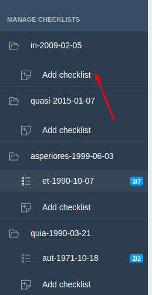
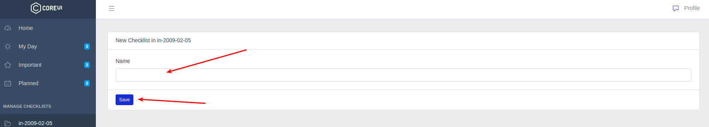
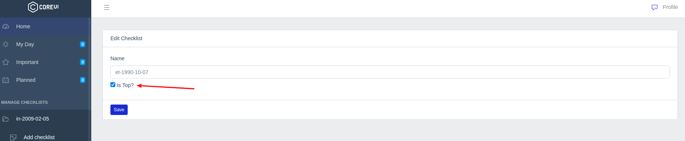
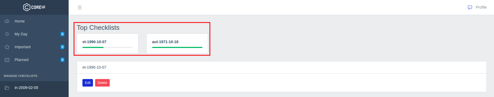

# Чеклисты

В боковом меню приложения выводятся чеклисты:

Каждый чеклист относится к определенной [группе чеклистов](../08-admin/README.md) и в меню располагается под этой группой.

По клику на название чеклиста открывается страница просмотра.

Рядом с названием чеклиста отображется статистика по включенным в него [задачам](../10-tasks/README.md) (сколько завершено/сколько всего задач):

Пользователи с правами [администратора](../07-admin/README.md) могут перейти на страницу редактирования чеклиста:

Или удалить его:

Также в боковом меню пользователям с правами [администратора](../07-checklists/README.md) после всех чеклистов в группе доступна ссылка на создание нового чеклиста:

Здесь необходимо указать название для нового чеклиста:

На странице редактирования чеклист можно добавить в топ-список:

Такие чеклисты вместе со статистикой по задачам в виде строки прогресса (сколько завершенных/сколько всего) отображаются на страницах всех чеклистов:

---

Следующее: [Задачи](../10-tasks/README.md)
