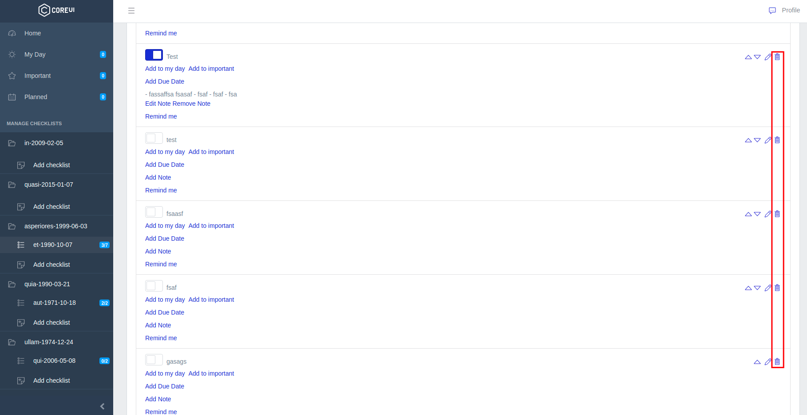

# Задачи

На странице просмотра [чеклиста](../09-checklists/README.md) отображается список относящихся к нему задач:

По кнопке

Можно создать новую задачу:

Здесь необходимо указать название и описание задачи. Описание задачи можно заполнять в WYSIWYG-редакторе и использовать специальное форматирование (жирный текст, курсив и пр.).

Можно выбрать и загрузить изображение, которое будет встроено в содержимое задачи:

Порядок задач можно изменять специальными кнопками:

Редактировать:

И удалять (после подтверждения):

Создавать, редактировать и удалять задачи могут только пользователи с правами [администратора](../07-checklists/README.md).

По клику на наименованию задачи можно развернуть её описание:

Также задачи можно делать завершенными:

Или отменять их завершение:

---

Следующее: [Страницы](../11-pages/README.md)
