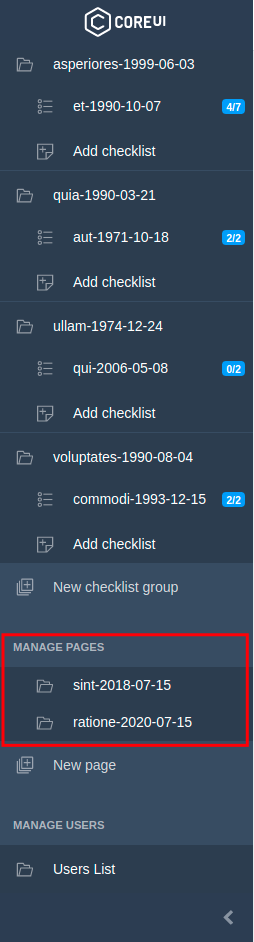
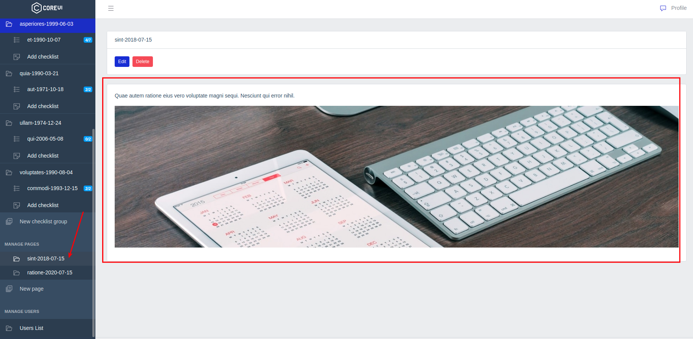
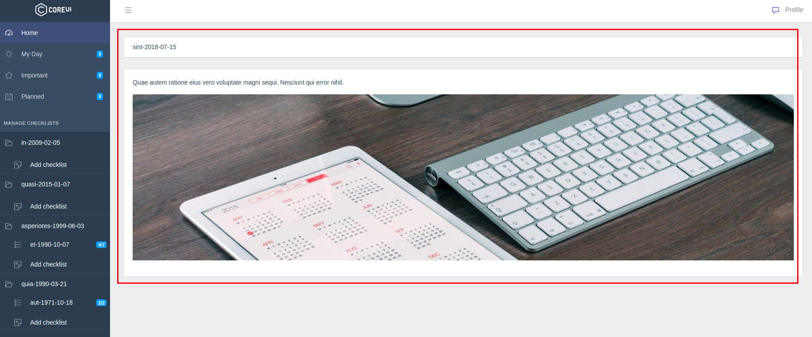
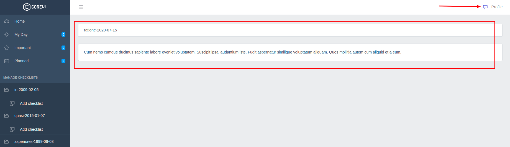
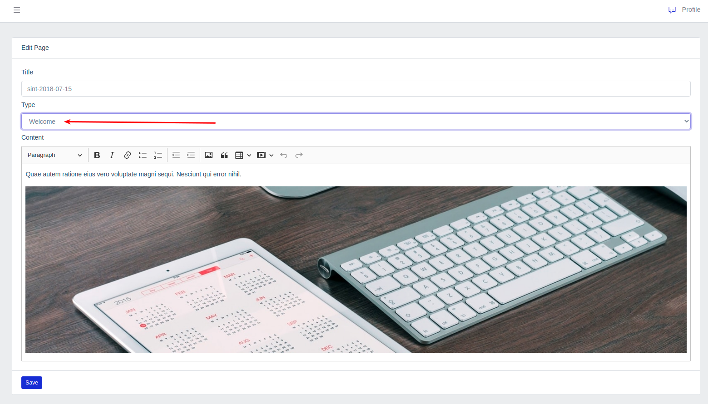
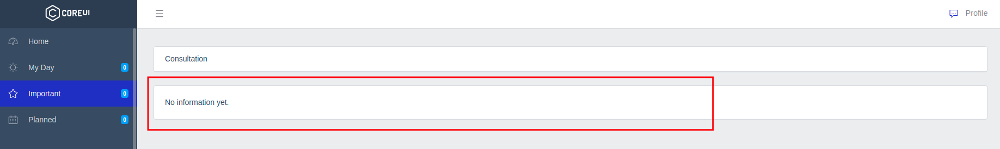
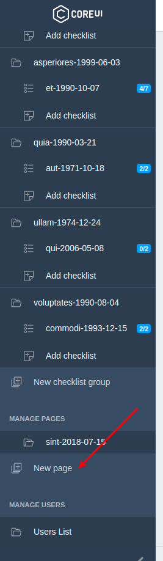
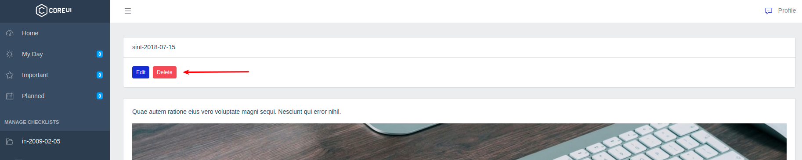

# Задачи

Администраторам доступно управление информационными страницами приложения:

По клику на страницу открывается просмотр её содержимого:

Страницы могут быть двух типов - **welcome** и **get-consultation**.

Первая доступна сразу после авторизации:

Вторая по клику на специальную иконку:

Тип страницы можно выбрать на странице её редактирования или создания новой страницы:

В случае отсутствия данных для этих страниц будут выведены шаблоны по-умолчанию:

Также администратор может создать новую страницу:

Или удалить существующую:

---

Следующее: [Пользователи](../12-users/README.md)
