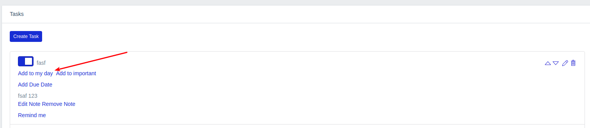
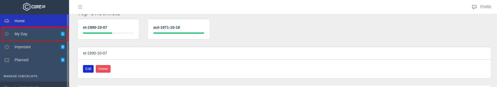
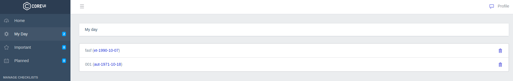
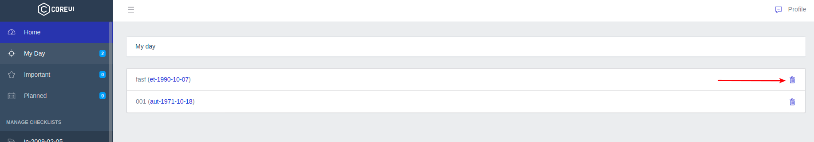
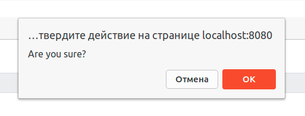

# Список задач "My Day"

Любую задачу из чеклистов можно добавить в специальный список "My Day":

Здесь можно собирать задачи, которые планируется сделать в текущий момент времени.

В боковом меню отображается ссылка на список всех добавленных задач с счетчиком их общего количества:

На странице отображаются все добавленные задачи:

Которые также можно удалить после подтверждения:

---

Следующее: [Список задач "Important"](../14-important-tasks/README.md)
