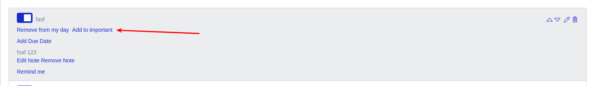
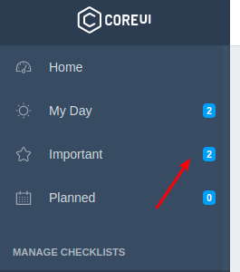
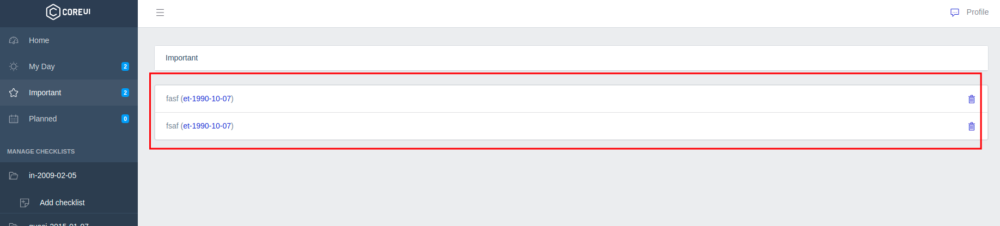
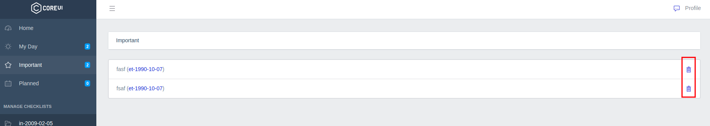

# Список задач "Important"

Любую задачу из чеклистов можно добавить в специальный список "Important":

Здесь можно собирать задачи, которые имеют высокий приоритет выполнения.

В боковом меню отображается ссылка на список всех добавленных задач с счетчиком их общего количества:

На странице отображаются все добавленные задачи:

Которые также можно удалить после подтверждения:

---

Следующее: [Список задач "Planned"](../15-planned-tasks/README.md)
