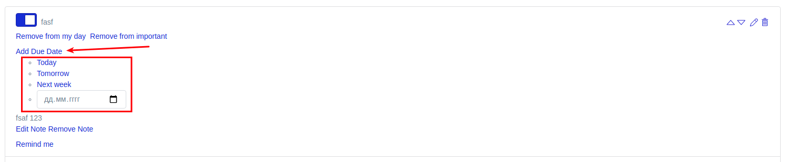
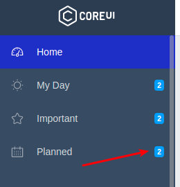
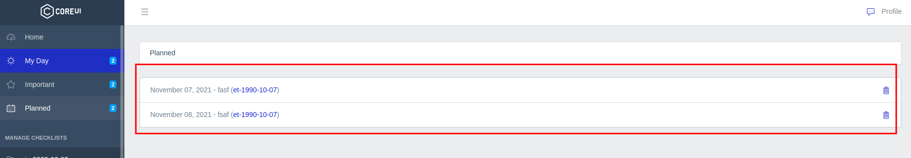
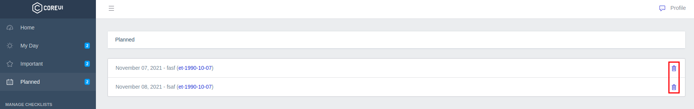

# Список задач "Planned"

Любую задачу из чеклистов можно добавить в специальный список "Planned":

Здесь для себя можно обозначить дату желаемого выполнения задачи - сегодняшний день, завтрашний день, через неделю от текущего дня или выбрать точную дату выполнения самостоятельно.

В этом списке можно собирать задачи, которые необходимо выполнить к определенному времени.

В боковом меню отображается ссылка на список всех добавленных задач с счетчиком их общего количества:

На странице отображаются все добавленные задачи:

Которые также можно удалить после подтверждения:

---

Следующее: [Напоминания о задачах](../16-remind-task/README.md)
