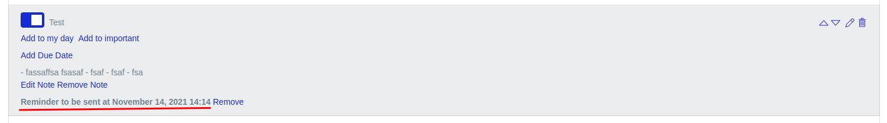

# Напоминания о задачах

Для любой задачи можно задать напоминание:

Здесь для себя можно обозначить дату желаемого напоминания - сегодняшний день, ближайший понедельник или выбрать точную дату и время напоминания самостоятельно.

После создания напоминания под задачей появится выбранная дата и время напоминания:

Напоминание придёт в виде email на почту зарегистрированного пользователя, создавшего это напоминание:

---

Следующее: [Подписка](../18-subscription/README.md)
