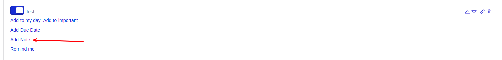
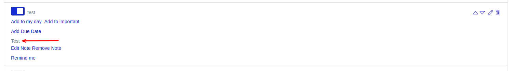
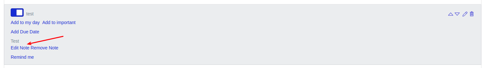
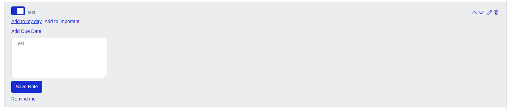
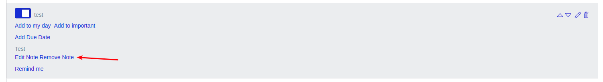

# Заметки по задачам

Для любой задачи можно задать заметку:

Она будет отображаться в блоке с задачей:

Заметку можно отредактировать:

Или удалить:

---

Следующее: [Подписка](../18-subscription/README.md)
