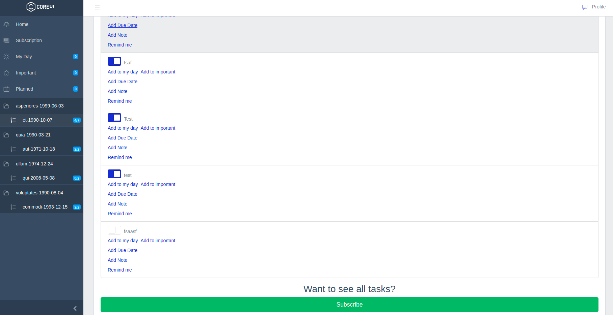
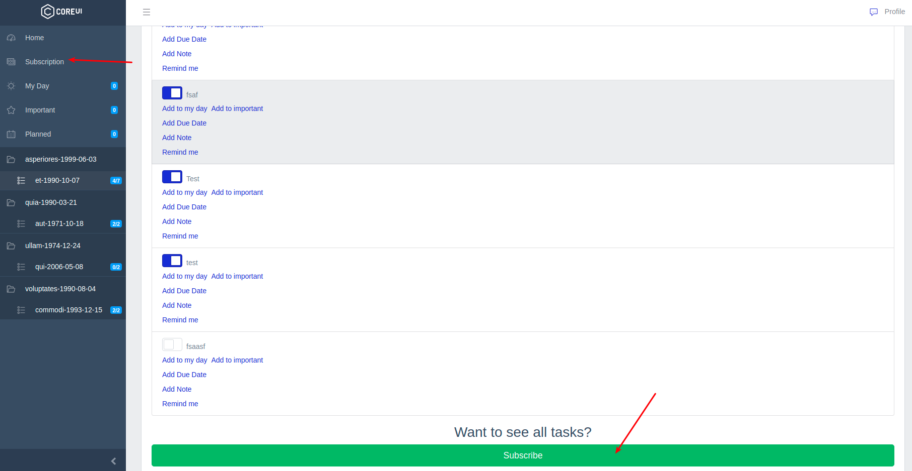
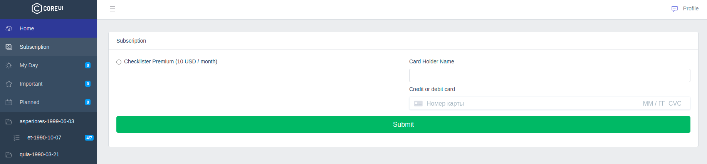
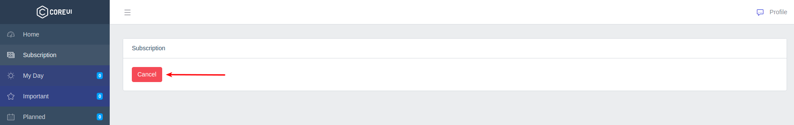

# Подписка

По-умолчанию, для пользователей в любом [чеклисте](../09-checklists/README.md) доступны только 5 задач. В этом случае на странице чеклиста отображается соответствующее сообщение:



Для отображения полного списка задач необходимо купить подписку.

На страницу с подпиской можно перейти либо со страницы чеклиста, либо из специального пункта меню:





После оформления подписки станут доступны все задачи.

На странице подписки можно отменить подписку:



Для корректной работы функционала подписок необходимо внести значения ключей от [Stripe](https://stripe.com/) в файл `.env`:

```
STRIPE_KEY=
STRIPE_SECRET=
```
